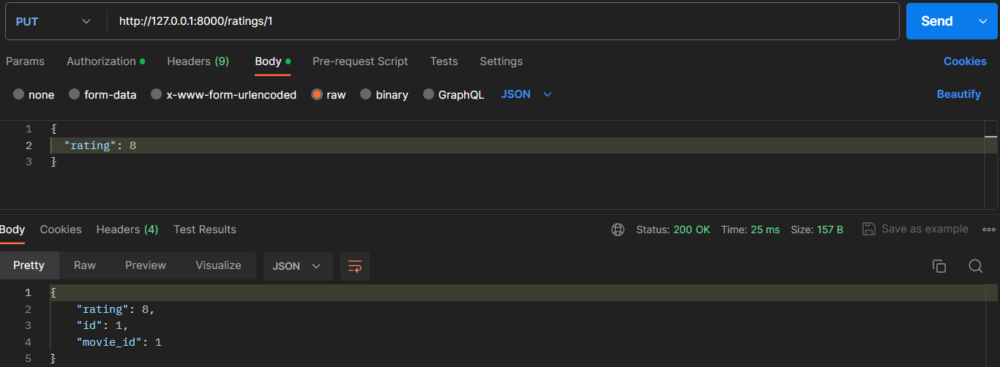

# Eindproject-API
*Jorben Sterckx 2CCS02*
## Thema API
Voor mijn project heb ik het thema **films** gekozen. 
Ik heb dit gekozen omdat ik graag films kijk en er al veel heb gegeken.

In mijn database staan 3 tabellen:
- users
- movies
- ratings

Door middel van POST requests kan ik films aanmaken. als ik inlog als een gebruikers kan ik een een rating aan een bepaalde film geven.

## Werking API
In deze sectie ga ik laten zien hoe mijn API werkt en welke endpoints ik heb gebruikt.

### POST
Ik heb 4 POST endpoints gemaakt.
1. De eerste dient voor het aanmaken van een token.
2. De tweede dient voor het aanmaken van een gebruiker.
3. De derde dient voor het aanmaken van een film.
4. De vierde dient voor het aanmaken van een rating voor een film.
#### Aanmaken van een user

#### Aanmaken van een film

#### Aanmaken van een rating

### GET
Ik heb 5 GET endpoints gemaakt:
1. De eerste dient voor het weergeven van alle gebruiker.
2. De tweede dient voor het weergeven van de huidige gebruiker.
3. De derde dient voor het weergeven van alle films.
4. De vierde dient voor het weergeven van alle ratings voor een bepaalde films.
5. De vijfde dient voor het weergeven van een bepaalde films.

#### Alle gebruikers weergeven

#### Alle films weergeven

#### Een bepaalde films weergeven

#### Alle ratings van een bepaalde films weergeven

### DELETE
Ik heb 1 DELETE endpoint gemaakt:
1. Deze dient voor het verwijderen van een rating voor een bepaalde films

#### Een bepaalde rating van een film verwijderen

### PUT
Ik heb 1 PUT endpoint gemaakt:
1. Deze dient voor het aanpassen van een rating.

#### Een rating van een film aanpassen

### Hashing & OAuth
#### Hashing
Ik heb hasing geïmplementeerd zodat het wachwoord dat ik
ingeef gehashed wordt. Hierdoor is het wachwoord niet
zichtbaar en moeilijk te achterhalen is.

#### OAouth
Ik heb ook Aouth geïmplementeerd zodat ik bij het inloggen
een token krijg zodat mijn gegevens op de server bewaard worder
en daardoor veiliger kan werken.

Via de post request van /users/ kan ik een gebruiker aanmaken
en hierna kan ik zoals op de foto's hierboven inloggen.

#### Postmanscreen
Op postman kan ik op 2 manieren authorizeren
1. Basic Auth:
Hier kan ik mijn username an password van de gebruiker die ik heb aangemaakt invullen.

   
3. Bearer Token:
Hier kan ik de token in die ik heb gekregen bij het aanmaken van een gebruiker invullen.

### Testing
In de root van mijn project heb ik een test file aangemaakt
die alle get-endpoint test.

### OpenAPI docs
Dit is mijn OpenAPI documentatie die ik terug vind wanneer ik naar mijn localhoste op poort 8000 /docs ga http://127.0.0.1:8000/docs.

### Hosted API
Dit is de link waar mijn API wordt gehost op Okteto: [Hosted API](https://api-service-jorbensterckx.cloud.okteto.net/)
